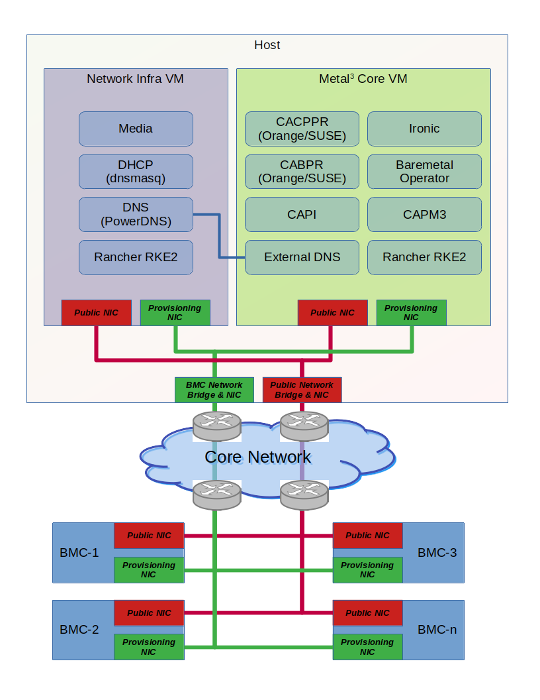

# Table Of Contents

- [Overview](#overview)
  - [Networking](#networking)
- [Prerequisites](#prerequisites)
- [How To Setup Metal3 Demo Environment](#how_to_setup_metal3_demo)

# Overview <a name="overview" />

This is the demo environment for
[Metal Kubed - Bare Metal Host Provisioning for Kubernetes][metal3]
The purpose of this environment is demonstrate the capabilities
of [Kubernetes Cluster API][CAPI], for Kubernetes workload cluster
life cycle management. The demo environment consist of two VMs,
Metal3 Network Infra and Metal3 Core respectively.

As depicted by the diagram above, the Metal3 Network Infra VM is designed
to emulate the infrastructure pieces, namely DNS, DHCP, and media server,
which are required by Metal3 and typically expected to be deployed outside
of the management cluster in a production environment. Metal3 Core VM has
all the pieces, namely CAPI (Cluster API) controller, RKE2 bootstrap provider
(CABPR), RKE2 control plane provider (CACPPR),
Metal3 infrastructure provider (CAPM3), Baremetal Operator, and
OpenStack Ironic, in a typical production Metal3 management cluster.
The external-dns controller on the Metal3 Core VM (management cluster)
is configured to use the PowerDNS running on the Metal3 Network Infra VM,
which illustrates what a production environment should look like.

## Networking <a name="networking" />

For security purposes, network segmentation is expected in production
environment, which usually consist of an internal provisioning network
for bare metal provisioning, and public network which is routable to
the internet. Therefore, the demo environment is designed to closely
align with a typically production use case. As such, the host where
the VMs are running is expected to have to networking bridges,
one for the provisioning network (BMC) and the other for the
public network (i.e. tagged VLAN).

# Prerequisites <a name="prerequisites" />

* Host is expected to have two network bridges, one for the provisioning
  network (BMC) and the other for the public network (i.e. tagged VLAN).
* Host with at least 32GB RAM & 200GB free disk space.
* Github credential (i.e. username/personal access token), for cloning repos

# How To Setup Metal3 Demo Environment <a name="how_to_setup_metal3_demo" />
- Refer to the [Metal3 Setup Doc](./docs/setup/metal3-setup.md) for a walkthrough of the Metal3 Demo environment setup.
- The [VBMH Setup Doc](./docs/setup/vbmh-setup.md) is a walkthrough of the setup of virtual machines to act as bare metal hosts.
- The [RKE2 Setup Doc](./docs/setup/rke2-cluster.md) is a walkthrough of the deployment of a sample RKE2 cluster on the virtual bare metal hosts.
- Example RKE2 deployment manifests exist [here](./sample-files/).

[CAPI]: https://cluster-api.sigs.k8s.io/introduction.html
[cloud_init_network_config]: https://cloudinit.readthedocs.io/en/latest/reference/network-config.html
[metal3]: https://github.com/metal3-io
